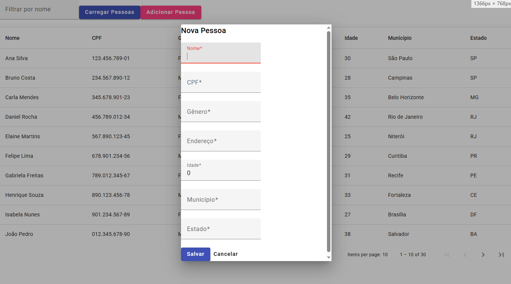

# 🧑‍💼 Sistema de Cadastro de Pessoas – Full Stack (.NET + Angular)

Este é um projeto full stack construído como teste técnico para processo seletivo. Ele inclui uma API em .NET 8 que gerencia dados de pessoas de forma dinâmica através de arquivos `.json` e um frontend em Angular 17 standalone, que permite consultar, adicionar e excluir registros com uma interface amigável.

---

## 🔧 Tecnologias Utilizadas

### Backend:
- ASP.NET Core 8 (Web API)
- C#
- Serialização JSON com `System.Text.Json`
- CORS habilitado para desenvolvimento
- Arquivo de persistência: `pessoas.json`

### Frontend:
- Angular 17 Standalone Components
- Angular Material (UI)
- RxJS
- TypeScript
- SCSS

---

## ▶️ Como Rodar o Projeto

### 📦 Pré-requisitos

- .NET 8 SDK
- Node.js 18+
- Angular CLI (`npm install -g @angular/cli`)
- Git (opcional)

---

### 🔌 1. Clonar o Repositório

```bash
git clone https://github.com/Raphael160192/Pasquali_PessoaApi
cd pessoas-app
```

---

### 🛠️ 2. Rodar o Backend

```bash
cd Backend
dotnet run
```

A API estará disponível por padrão em:  
**http://localhost:5000/api/pessoas**

---

### 🌐 3. Rodar o Frontend

```bash
cd ../Frontend
npm install
ng serve
```

A interface estará disponível em:  
**http://localhost:4200**

---

## ✅ Funcionalidades Implementadas

### 🔍 Listagem de Pessoas

- Tabela com paginação, filtro e ordenação.
- Dados carregados diretamente da API.

### ➕ Adicionar Pessoa (extra) ✅✅✅

- Botão **"Adicionar Pessoa"** abre um **modal responsivo**.
- Formulário com validações de campos obrigatórios, CPF, e formatos.
- Envio via método `POST` para o backend.
- Recarregamento automático da lista.



---

## 🧪 Testando a API com Insomnia/Postman

### `GET /api/pessoas`
Retorna a lista de pessoas.

### `POST /api/pessoas`
Cria uma nova pessoa.
```json
{
  "nome": "João Silva",
  "cpf": "123.456.789-00",
  "genero": "Masculino",
  "endereco": "Rua Exemplo, 123",
  "idade": 35,
  "municipio": "São Paulo",
  "estado": "SP"
}
```

### `DELETE /api/pessoas/{id}`
Exclui a pessoa com o ID fornecido.

---

## ⚙️ Detalhes Técnicos e Extras

- Os dados são persistidos no arquivo `Backend/Data/pessoas.json`.
- O arquivo deve estar com codificação UTF-8 (sem BOM) para evitar problemas com acentuação.
- O backend utiliza um `PessoaService` para manipulação dos dados, mantendo separação de responsabilidades.
- O frontend está 100% em Angular Standalone, o que demonstra domínio da abordagem moderna Angular 17+.

---

## 📝 Observações

Este projeto demonstra:
- Boas práticas com separação de camadas.
- Código limpo, organizado e reutilizável.
- Frontend responsivo e funcional.
- Persistência local simulando banco de dados.
- Implementações extras não requeridas que agregam valor.

---

